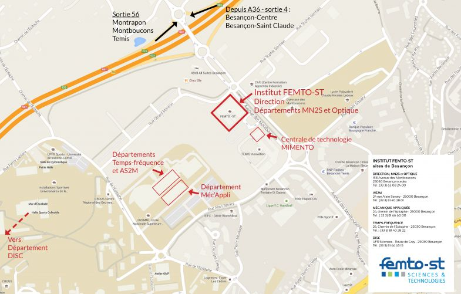

# About the team, dept and institute

## The Neuro group in the AS2M Department

The [FEMTO Neuro Group](https://neuro-team-femto.github.io) is a research group of the [Dept. of Automation and Robotics](https://www.femto-st.fr/en/Research-departments/AS2M/Presentation), [FEMTO-ST Institute](https://www.femto-st.fr/en). 

The FEMTO [Dept. of Automation and Robotics](https://www.femto-st.fr/en/Research-departments/AS2M/Presentation) (AS2M, for _Automatique et Systèmes Micromécatroniques_) is the host to about 35 full-time faculty, and a total of about 75 members including PhD students and postdocs. It is currently directed by Prof. Yann Le Gorrec (automation) and deputy director Prof. Cédric Clevy (robotics).

<iframe width="560" height="315" src="https://www.youtube.com/embed/3fsEKECEpmY?si=2nstzond-h7_mL-M" title="YouTube video player" frameborder="0" allow="accelerometer; autoplay; clipboard-write; encrypted-media; gyroscope; picture-in-picture; web-share" allowfullscreen></iframe>

The department conducts research in the fields of robotics, mechatronics, automatic control and artificial intelligence. It is organized in 3 research _teams_: [ROBIMSS](https://www.femto-st.fr/en/Research-departments/AS2M/Research-groups/ROBIMSS) (Robotics, manipulation and instrumentation at micro-nanoscales; head: Dr Aude Bolopion), [ROMOCO](https://www.femto-st.fr/en/Research-departments/AS2M/Research-groups/ROMOCO) (Robotics, Modelling and Control; head: Dr Redwan Dahmouche), and [DATAPHM](https://www.femto-st.fr/en/Research-departments/AS2M/Research-groups/DATA-PHM) (Data-science and Health Management; head: Prof. Jean-Marc Nicod), and we're part of the latter. The DATAPHM team is further organized in 3 groups: PHM (PIs: Prof. Zerhouni, AL Masry, Soualhi and Dridi), Sustainable decision (PIs: JM Nicod, C. Vannier), and the Neuro Group (PIs: JJ Aucouturier, P. Nectoux). 

## About labs, teams and groups

In academia, it is common to refer to the smallest research unit in a Department as a "lab" (ex. Jonathan Peele's [lab](http://peellelab.org/) in Northeastern University, which inspired parts of this manual). In addition, we may refer to a "team" relatively informally, as a group of people working on the same thing (who could be in the same lab, or not). 

In French academia however, these words have a different, and more formal, meaning: 

- the "lab" (_laboratoire_) is not the smallest, but rather the biggest organizing unit, also called _unité_, UMR (_unité mite de recherche_): in our case, what we refer to as "le laboratoire" is the whole FEMTO-ST Institute, which its 750 people. Large labs, like FEMTO, sometimes call themselves Institutes, and may be organized in Departments (as we are here), but they are still formally "labs". The lab director is called _directeur d'unité_ or DU (As of Oct. 2023, the DU for FEMTO-ST is Prof. Laurent Larger, and incumbant director starting Jan. 2024 is Dr Michael Gauthier)
	
- "teams" (_équipes_) have also a formal meaning, because they are the functional subunits in the lab which research are evaluated by [HCERES](https://www.hceres.fr/en) (High Council for Evaluation of Research and Higher Education). They may not necessarily consist of people working on the same topic, but are generally linked by some overarching theme or methodology. In our case, the AS2M Dept is organized in three "teams", inc. Team DATAPHM, which the Neuro group is part of.   		

- "groups" (_groupe_) does not have any standard meaning (!), and is just the word we agreed upon to divide team DATAPHM into thematic units, such as the Neuro group.   

In short, if you want to speak fluent French academiclang, the Neuro _group_ is one of the 3 groups of the DATAPHM _team_, which is one of the 3 teams of the AS2M _Department_, which is one of the seven Department of "the lab" (the FEMTO-ST Institute). Internally, and in these pages, we may refer to the Neuro group as "the lab", but depending on context you may want to switch meaning. 

!!! Warning
	For extra confusion, you may hear people (typically older members of the faculty) refer to the Department as "the lab" too. This is because the FEMTO-ST Institute was created reletively recently as the merger of several independent units (i.e. "labs" in the French meaning), one of which was the _Laboratoire d'Automatique de Besançon_ (LAB) which became the AS2M Dept. So Departments were previously independent "labs", which became "departments" when they joined what has now become "the lab", i.e. the FEMTO-ST Institute. That usage of the word "lab" to refer to the department is not encouraged (and tends to disappear anyways).  

## The AS2M Dept. in the FEMTO-ST Institute

With more than 750 researchers, the [FEMTO-ST Institute](https://www.femto-st.fr) is the region's and one of the country's largest engineering CNRS lab, with expertise covering all fields of engineering and system science (check [this page](https://www.femto-st.fr/en/online-documents) for a yearly report of research highlights across the whole institute, if interested).

The Institute is co-operated by [Centre National de la Recherche Scientifique](https://www.cnrs.fr) (CNRS), [Université de Franche-Comté](https://www.univ-fcomte.fr/)(UFC), l'[Ecole Nationale Supérieure de Mécanique et des Microtechniques](https://www.supmicrotech.fr)(SUPMICROTECH) and l'[Université de Technologie de Belfort-Montbéliard](https://www.utbm.fr) (UTBM) (see [this page](../about-our-operating-institutions)) 

<iframe width="560" height="315" src="https://www.youtube.com/embed/ADETGBVilUw?si=gNMBz_4NzYkJ-yqZ" title="YouTube video player" frameborder="0" allow="accelerometer; autoplay; clipboard-write; encrypted-media; gyroscope; picture-in-picture; web-share" allowfullscreen></iframe>

The Institute is organized into seven departments, who are located across three research sites in Besançon, Belfort and Montbéliard:

- [Automation and Robotics](https://www.femto-st.fr/en/Research-departments/AS2M/Presentation) (AS2M) in Besançon

- [Computer Science and Complex systems](https://www.femto-st.fr/en/Research-departments/DISC/Presentation) (DISC) in Besançon, Belfort and Montbéliard.

- [Energy](https://www.femto-st.fr/en/Research-departments/ENERGY/Presentation) in Belfort

- [Applied Mechanics](https://www.femto-st.fr/en/Research-departments/APPLIED-MECHANICS/Research-groups) (DMA) in Besançon

- [Micro Nano Sciences & Systems](https://www.femto-st.fr/en/Research-departments/MN2S/Presentation) (MN2S) in Besançon and Montbéliard

- [Optics](https://www.femto-st.fr/en/Research-departments/OPTICS/Presentation) in Besançon

- [Time & Frequency](https://www.femto-st.fr/en/Research-departments/TIME-and-FREQUENCY/Presentation) (TF) in Besançon

The 6 Departments that are present on the Besançon research site are located in three different buildings: 

- The FEMTO-ST headquarters, the Optics Department and the main site of the MN2S department are located in the TEMIS building (15B avenue des Montboucons). 

- The AS2M (that's us), Applied Mechanics, TF departments are located at the SUPMICROTECH building.

- The DISC department is located on the University campus.

<figure markdown>
  { width="80%" }
  <figcaption>Campus map of the 3 Besançon sites</figcaption>
</figure>

