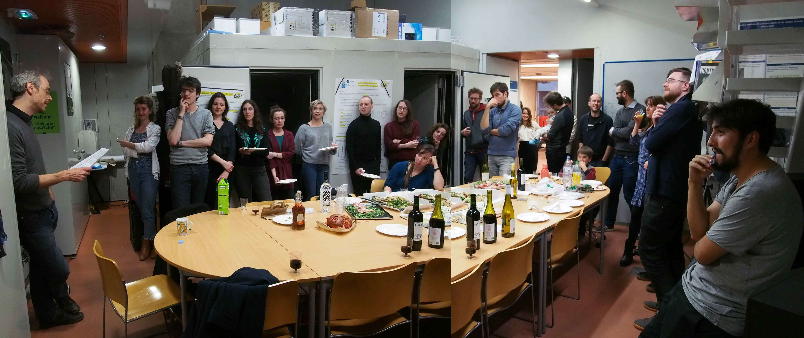

# Lab history

## The FEMTO Neuro Group (2021 ~)

The [FEMTO Neuro Group](https://neuro-team-femto.github.io) was established in the [FEMTO-ST Institute](https://www.femto-st.fr/en) by PIs JJ Aucouturier and Patrick Nectoux in Jan. 2021. 

The group moved from its previous installment as the [CREAM music neuroscience team](http://cream.ircam.fr/) (2014-2020) at the [Science and Technology of Music and Sound Lab](https://www.stms-lab.fr/) (STMS, IRCAM/CNRS/Sorbonne Université) in [IRCAM](https://www.ircam.fr/), Paris, France. Doing so, the mission of the group has changed from a focus on signal processing techniques to manipulate and control sound and music stimuli in cognitive neuroscience research, to explore novel control engineering approaches to the study of human sensory electrophysiology, and a stronger clinical element working with psychiatry and neurology patients. We build on our signal-processing history, but also look forward to the numerous opportunities brought by our new enscription in the FEMTO-ST Institute [Department of Automation and Robotics](https://www.femto-st.fr/en/Research-departments/AS2M/Presentation). 

<figure markdown>
  { width="80%" }
  <figcaption>The lab ca. May 2023. From left to right: Paul Maublanc, Camille Des Lauriers, Paige Tuttösi, Rudradeep Guha, Coralie Joucla, Jean-Julien Aucouturier, Patrick Nectoux, Aynaz Adl Zarrabi.</figcaption>
</figure>

  
    
  April 2023. Our EEG lab cabins are installed.

## The CREAM team (2014 - 2020)

The CREAM team was originally funded by an ERC Starting Grant (Cracking the Emotional Code of Music - 335536, PI: JJ Aucouturier) and has then received subsequent funding by ANR REFLETS (2017-2021) and Fondation pour l’Audition ([Prix d’Emergence scientifique 2018](https://www.youtube.com/watch?v=toHbRQMHB-w)).

<figure markdown>
  { width="80%" }
  <figcaption>Farewell part for the CREAM team, Nov. 2020.</figcaption>
</figure>

The research vision of the CREAM team was to bridge over the two disciplines of audio signal processing and cognitive neuroscience/psychology, and turn voice and music into cognitive technologies, with algorithms to create sounds able to selectively activate certain neural pathways, or certain emotions. To this aim, the project introduced several novel methodologies to study the effect of sound on the brain, in the form of acoustic transformation software (SMILE; [DAVID](http://forumnet.ircam.fr/product/david), 2800 downloads as of Jan 2021; [CLEESE](http://forumnet.ircam.fr/product/cleese), 950 downloads; [ANGUS](http://forumnet.ircam.fr/product/angus), 1200 downloads). These technologies formed the basis of experimental research articles notably published in PNAS ([2016](https://www.pnas.org/content/113/4/948); [2018](https://www.pnas.org/content/115/15/3972)), Current Biology ([2018](https://www.cell.com/current-biology/fulltext/S0960-9822\(18\)30752-8); [2021](https://www.cell.com/current-biology/fulltext/S0960-9822\(21\)01195-7)) and Nature Communications ([2021](https://www.nature.com/articles/s41467-020-20649-4)).

Over the course of the project (2014-2020), the CREAM team employed more than 15 PhD-level scientists, roughly half of them coming from a computer science or audio engineering background, and the other half from a psychology or cognitive neuroscience background - a diverse, amazing crew of young scientists which have since the end of the project moved on, several of them to start their own independent positions. Beyond academia, the software technologies produced in the project have also been transfered to the voice technology startup [Alta Voce](http://alta-voce.tech), which is now testing the impact of real-time voice transformation in the field of customer relation.

The CREAM team/project ended in December 2020. [This page](https://neuro-team-femto.github.io/cream/) archives the team’s key publications, team members and where each of these people went. 