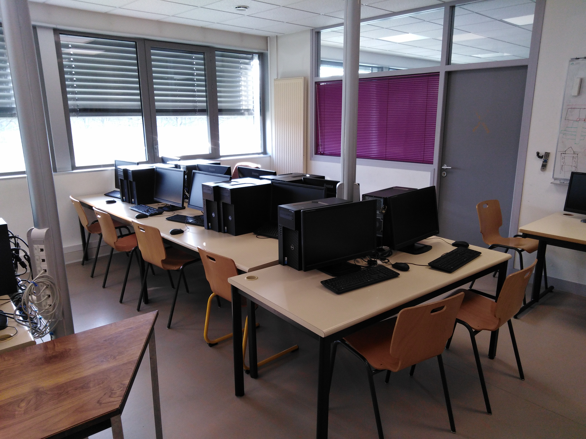
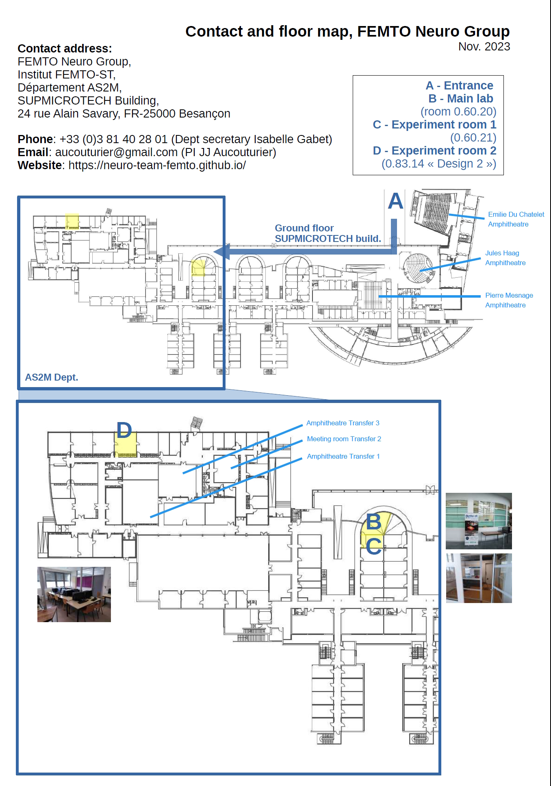

# Lab space

## Contact information

The FEMTO Neuro Group is located in the SUPMICROTECH building, [Dept. of Automation and Robotics](https://www.femto-st.fr/en/Research-departments/AS2M/Presentation), [FEMTO-ST Institute](https://www.femto-st.fr/en) in Besançon, France. 

**Contact address:** ([google map](https://www.google.com/maps/place/24+Rue+Alain+Savary,+25000+Besan%C3%A7on), [floor map](../images/neuro_map.pdf))

>  FEMTO Neuro Group (JJ Aucouturier)  
>  Institut FEMTO-ST, Département AS2M,  
>  24 rue Alain Savary,  
>  25000 Besançon, France  

**Phone:** +33 (0)3 81 40 28 01 (Dept. Secretary Isabelle Gabet)

**Email:** aucouturier@gmail.com (PI JJ Aucouturier)

**Website:** [https://neuro-team-femto.github.io/](https://neuro-team-femto.github.io/)

In addition to our primary location in Besançon, the group is also co-located with a remote team in two Paris hospitals (Hôpital Pitié Salpêtrière and GHU Paris Psychiatrie et Neurosciences). 

## Facilities

Our dedicated lab space consists of two rooms: 

- The panoramic "bureau paysager" (room 0.60.20, see note about room numbering below), which hosts office space for up to 6 people. This is where our lab meetings are organized. 

  
    
  <i>Room 0.60.20 (main room)</i>

- Room 0.60.21, which host extra office space for two people, as well as our electrophysiology lab and cabins. 

  
    
  <i>Room 0.60.21 (EEG lab)</i>

In addition, we often 
- room Design 2 (0.83.14), in the _Transfert_ Building, in which we collect behavioural data for simultaneous groups of up to 15 participants. 

<figure markdown>
  { width="80%" }
  <figcaption>Design 2 room, which we use for behavioral data collection</figcaption>
</figure>

## Orientation in the SUPMICROTECH Building

The lab is hosted in the [SUPMICROTECH](https://www.supmicrotech.fr/) (prev. known as ENSMM - pronounced enn-sem) building, which hosts 3 FEMTO-ST departments: [AS2M](https://www.femto-st.fr/en/Research-departments/AS2M/Presentation) (French: Automatique et Systèmes Micromécatroniques; English: Automation & Robotics); [TF](https://www.femto-st.fr/en/Research-departments/TF/Presentation) (French: Temps-Fréquence; English: Time-Frequency); [DMA](https://www.femto-st.fr/en/Research-departments/APPLIED-MECHANICS/Research-groups) (French: Département de Mécanique Appliquée; English: Applied mechanics); as well as a teaching space for a relatively large _école d'ingénieur_ (Engineering grad school _ENSMM_ for _École Nationale Supérieure de Mécanique et des Microtechniques_, now rebranded as [SUPMICROTECH](https://www.supmicrotech.fr/)) and a variety of associated administrative services. 

A map of the ENSMM building can be found [here](../images/neuro_map.pdf)

<figure markdown>
  { width="80%" }
  <figcaption>Contact info and floor map</figcaption>
</figure>

**Room numbering** in SUPMICROTECH is confusing, as it obeys to a 3D coordinate system ordered as height; length; width. Our common lab space 0.60.20 is on the ground floor (0), down the hall from the ENSMM main entrance (about 60 meters, probably), and not very far away from the front glassed part of the building (indeed, we directly face it). Our EEG room is one room further orthogonally from the front facade, and logically goes by 0.60.21. A room like 0.77.16 (seminar room Transfert #3, see below) you can infer is on the same floor (Ground floor 0), further away from main entrance (77, indeed in the neighboring "Transfert" building) and further on the right than the lab (towards the car park). Sounded like a good idea - but in practice nobody ever remembers the coordinate system and we address rooms by names...

## Meeting rooms

If you need more space or privacy for meetings that what our common lab space can accomodate, the department has a number of rooms that can be booked via the FEMTO-ST room reservation web service ([https://booked.femto-st.fr](https://booked.femto-st.fr)).&#x20;

**Recommended meeting spaces** are:&#x20;

* AS2M meeting room (==room XX.XX.XX==, next to Isabelle & Estelle's). Good for 4-6 people, has projector & white board. That's your easiest option.
* TF meeting room (==room XX.XX.XX==) : slightly larger, projector & white board. The neighboring TF (Temps-fréquence) dept. meeting room, which we are allowed to use occasionally
* Transfer #2 (room 0.73.16, Transfert building). Good for 10-15 people, has a projector and a large white board, relatively pleasing even for one-to-one brainstorm on the white board.

!!! Note "Booking rooms"

	Rooms in Transfert building cannot be booked by the FEMTO room reservation service, but by email to accueil@ens2m.fr (alternatively, go and chat to the person at the SUPMICROTECH reception to ask for room availability)

**Recommended rooms for seminars**:&#x20;

* Amphi / salle Transfert 3 (room 0.77.16, in neighboring "Transfert" building). A large classroom (30-40 ppl) with a speaker stand and plateform. Suitable for small seminars.
* Amphi Jules Haag (==room XX.XX.XX==). A nice, round lecture hall suitable for 50-100 people. Just behind the SUPMICROTECH front desk/reception. JJ's favorite as it's easy to find for external people, and pleasing to address as a speaker
* Amphi Pierre Mesnage (==room XX.XX.XX==). A somewhat older-looking lecture hall suitable for 50-100 people, similar to Jules Haag.&#x20;
* Amphi Emilie Du Chatelet (==room XX.XX.XX==). A huge (400 people+) lecture hall that's typically only suitable for general assembly or conferences. In neighboring building _Bâtiment Tesla.

!!! note 
	As for rooms in Transfert building, SUPMICROTECH amphitheatre (Haag, Mesnage, Du Chatelet) cannot be booked by the FEMTO room reservation service, but by email to accueil@ens2m.fr

Further away, but also useful:

* Amphi Jean-Jacques Gagnepain, is a modern, fancy seminar room in the TEMIS Science building (Avenue des Montboucons, a 5 min. walk from SUPMICROTECH). Suitable for 50-70 people, commonly used for PhD defenses. Can be booked by FEMTO room reservation service.
