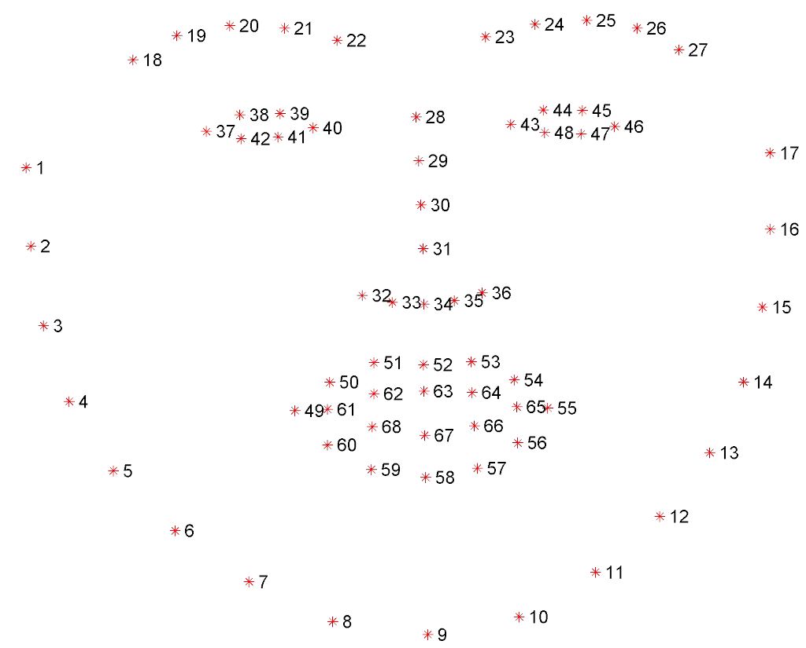

# Face Warp

CLEESE's `FaceWarp` engine works by first identifying a set of landmarks on the visage present in the image. Then a gaussian distribution of
deformation vectors is applied to a subset of landmarks, and the Moving Least Squares (MLS) algorithm is used to apply the deformation to the image itself.
Alternatively, a precomputed set of deformations can also be provided.

## Modes of operation

CLEESE can be used in different modes, depending on which function you call and how. 

## Batch generation

CLEESE has a dedicated function for batch treatments: `cleese.generate_stimuli`, which is used, in `Mediapipe`'s case, to generate a number of randomly deformed visages.

``` py 
import cleese_stim as cleese
from cleese_stim.engines import Mediapipe

inputFile  = 'path_to_input_image.jpg'
configFile = 'path_to_config_file.toml'

cleese.generate_stimuli(Mediapipe, inputFile, configFile)
```

Two parameters have to be set by the user:

- `inputFile`: the path to the base image, which can be any image format readable and writeable by `PIL`.
- `configFile`: the path to the configuration script

All the generation parameters for all treatments are set up in the configuration script that has to be edited or created by the user. An example
of configuration script with parameters for all treatments is included with the toolbox: `cleese-mediapipe.toml`. Configuration parameters will be
detailed below.

For each run in batch mode, the toolbox generates the following folder structure, where `<outPath>` is specified in the parameter file:

- `<outPath>/<currentExperimentFolder>`: main folder for the current generation experiment. The name `<currentExperimentFolder>` is automatically created from the current date and time. This folder contains:
	- `<baseImage.ext>`: a copy of the base image used for the current experiment
	- `*.toml`: a copy of the configuration script used for the current experiment
	- `<baseimage>.xxxxxxxx.<ext>`: the generated deformed image, where `xxxxxxxx` is a running number (e.g.: `monalisa.00000001.jpg`)
	- `<baseimage>.xxxxxxxx.dfmxy`: the generated deformation vectors, in CSV format, for the generated stimulus (e.g.: `monalisa.00000001.dfmxy`)
	- `<baseimage>.landmarks.txt`: the list of all landmarks positions as detected on the original image, in ASCII format, readable with `numpy.loadtxt`.

### Array input and output

CLEESE can also provide a single result, based on data loaded previously in a script or directly loading a file.

*From array:* 

Here, you can also use `PIL.Image`'s `np.array(Image.open("path/image.jpg").convert("RGB"))` to load the image.
The `Face Mesh` API requires that the image be in RGB format.

```py
import cleese_stim as cleese
from cleese_stim.engines import Mediapipe

inputFile  = 'path_to_input_image.jpg'
configFile = 'path_to_config_file.toml'

img = Mediapipe.load_file(inputFile)
deformedImg = cleese.process_data(Mediapipe, img, configFile)
```

*From file:*
```py 
import cleese_stim as cleese
from cleese_stim.engines import Mediapipe

inputFile  = 'path_to_input_image.jpg'
configFile = 'path_to_config_file.toml'

deformedImg = cleese.process_file(Mediapipe, inputFile, configFile)
```

In both of those cases, no files or folder structures are generated.

### Applying a deformation

Both `cleese.process_data` and `cleese.process_file` function allow for applying a precomputed set of deformations instead of generating them
randomly. CLEESE can accept both `.dfmxy` deformations (absolute cartesian deformation vectors), and `.dfm` deformations (deformation
vectors mapped onto a triangulation of face landmarks (dlib landmarks indices)).

``` py 
import cleese_stim as cleese
from cleese_stim.engines import Mediapipe

dfmxyFile = 'path_to_dfmxy.dfmxy'
dfmFile = 'path_to_dfm.dfm'
imageFile  = 'path_to_input_image.jpg'
configFile = 'path_to_config_file.toml'

# .dfmxy processing
dfmxy = Mediapipe.load_dfmxy(dfmxyFile)
img = cleese.process_file(Mediapipe,
                          imageFile,
                          configFile,
                          dfmxy=dfmxy)

# .dfm processing
dfm = Mediapipe.load_dfm(dfmFile)
img = cleese.process_file(Mediapipe,
                          imageFile,
                          configFile,
                          dfm=dfm)
```

### Converting deformation files

Other face deformation tools developed by our team use the `.dfm` deformation file format, more suited to applying the same deformation to an
arbitrary face. However, by its use of barycentric coordinates in a landmarks triangulation, it isn't suited to any post or pre-processing, which is an area
where `.dfmxy` shines. As a result, CLEESE's Mediapipe provides a way to convert a given, `.dfmxy` to `.dfm`, provided you also have the original landmarks on hand:

```py 
import cleese_stim as cleese
from cleese_stim.engines import Mediapipe

dfmxyFile = 'path_to_dfmxy.dfmxy'
dfmFile = 'path_to_dfm.dfm'
landmarksFile = 'path_to_landmarks.txt'

img = cleese.dfmxy_to_dfm(dfmxyFile,
                          landmarksFile,
                          output_dfm_file=dfmFile)
```

## Configuration

The following parameters are used to configure the `Mediapipe` engine:

``` toml
[mediapipe.random_gen]
# Indices of the landmarks to be modified, using Dlib's 68 landmarks indexing
landmarks.dlib = []

# Indices of the landmarks to be modified, using Mediapipe's 468 landmarks indexing
landmarks.mediapipe = [61, 40, 78, 91, 270, 308, 321, 291]  # lips corners

# Sets of landmarks to be modified, using precomputed sets
# "dlib-eyebrow-right", "dlib-eyebrow-left", "dlib-nose",
# "dlib-eye-right", "dlib-eye-left", "dlib-outer-lips",
# "dlib-inner-lips", "dlib-lips", etc...
# See cleese/engines/mediapipe.py for a full list
landmarks.presets = ["dlib-lips"]

# Covariance matrix used to generate the gaussian distribution of landmarks
# offsets. It is scaled according to the height of the detected face. As a
# result, the amount of deformation should be resolution-invariant.
covMat = [[0.0002, 0.0], [0.0, 0.0002]]

[mediapipe.mls]
# Alpha parameter of the MLS deformation.
# Affects how much the deformation "spreads" from the landmarks
alpha = 1.2

[mediapipe.face_detect]
# Minimum face detection confidence
threshold = 0.5
```

- `mediapipe.random_gen.landmarks`: Selection of landmarks on which to apply a deformation. Then can be defined in a few different ways:
	- `landmarks.dlib`: Array of landmark indices, using dlib's Multi-PIE 68 landmarks indexing (see figure below).
	- `landmarks.mediapipe`: Array of landmark indices, using mediapipe's 468 vertices face mesh (see Google's documentation [here](https://github.com/google/mediapipe/blob/master/mediapipe/modules/face_geometry/data/canonical_face_model_uv_visualization.png))
- `landmarks.presets`: Array of name of landmarks presets. For now, only subset of dlib's indices are implemented.
- `covMat`: The covariance matrix used when drawing the distribution of deformation vectors. the unit vector is scaled according to height of the detected face, to enable for scale-invariant deformations.
- `mediapipe.mls.alpha`: Moving Least Squares (MLS) algorithm alpha parameter, affecting the "spread" of the deformation.
- `mediapipe.face_detect.threshold`: Threshold for the confidence metric of mediapipe's face detector. Ajust if faces aren't detected, or if things that aren't faces are detected.


<figure markdown="span">
  { width="30%" }
  <figcaption>Dlib's 68 Multi-PIE landmarks, 1-indexed.</figcaption>
</figure>

