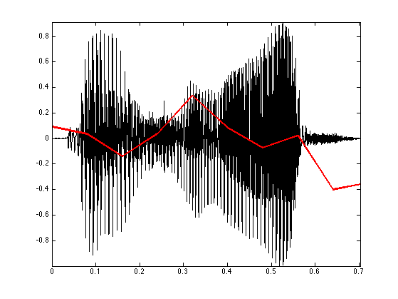
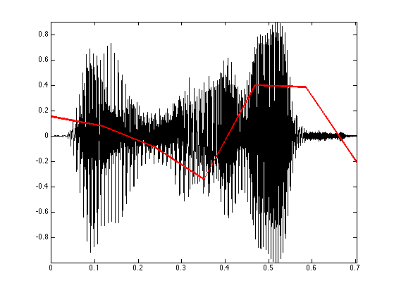
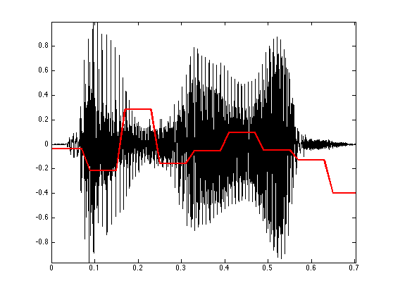
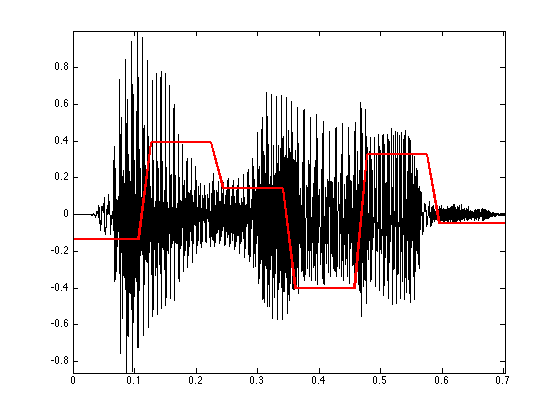

# PhaseVocoder Engine 

CLEESE's `PhaseVocoder` engine operates by generating a set of random breakpoint functions (BPFs) in the appropriate format for each treatment, which
are then passed to the included spectral processing engine (based on an implementation of the Phase Vocoder algorithm) with the corresponding parameters. Alternatively, the BPFs can be externally created by the user, and so it can also be used as a Phase Vocoder-based effects unit.

## Modes of operation

CLEESE can be used in several different modes, depending on how the main processing function is called. Examples of several typical usage scenarios are
included in the example script \texttt{run\_cleese.py}.

### Batch generation

In batch mode, CLEESE's `PhaseVocoder` engine generates many random modifications from a single input sound file, called the base sound. It can be
launched as follows:

``` py 
import cleese_stim as cleese
from cleese_stim.engines import PhaseVocoder

inputFile  = 'path_to_input_sound.wav'
configFile = 'path_to_config_file.toml'

cleese.generate_stimuli(PhaseVocoder, inputFile, configFile)
```

Two parameters have to be set by the user:

- `inputFile`: the path to the base sound, which has to be a mono sound in WAV format.

- `configFile`: the path to the configuration file

All the generation parameters for all treatments are set up in the configuration file that has to be edited or created by the user. An example of
configuration file with parameters for all treatments is included with the toolbox: `cleese-phase-vocoder.toml`. Configuration parameters will be
detailed below.

For each run in batch mode, the toolbox generates the following folder structure, where `<outPath>`} is specified in the parameter file:

- `<outPath>/<currentExperimentFolder>`: main folder for the current generation experiment. The name `<currentExperimentFolder>` iscautomatically created from the current date and time. This folder contains:
    - `<baseSound>.wav`: a copy of the base sound used for the current experiment
    - `*.toml`: a copy of the configuration script used for the current experiment
	- one subfolder for each one of the performed treatments, which can be either `pitch`,  `stretch`, `gain`, `eq`, or a combination (chaining) of them. Each of them contains, for each generated stimulus:
		- `<baseSound>.xxxxxxxx.<treatment>.wav`: the generated stimulus, where `xxxxxxxx` is a running number (e.g.: `cage.00000001.stretch.wav`)
		- `<baseSound>.xxxxxxxx.<treatment>BPF.txt`: the generated BPF, in ASCII format, for the generated stimulus (e.g.: `cage.00000001.stretchBPF.txt`)

### Passing a given BPF

When passing the `BPF` argument to `cleese.generate_stimuli`, it is possible to impose a given BPF with a certain treatment to an input file. In
this way, the toolbox can be used as a traditional effects unit.

``` py 
import numpy as np

import cleese_stim as cleese
from cleese_stim.engines import PhaseVocoder

inputFile  = 'path_to_input_sound.wav'
configFile = 'path_to_config_file.toml'

givenBPF = np.array([[0.,0.],[3.,500.]])
cleese.generate_stimuli(PhaseVocoder, inputFile, configFile, BPF=givenBPF)
```

The `BPF` argument can be either:
 - a numpy array containing the BPF
 - a scalar, in which case the treatment performed is static

In this usage scenario, only one file is output, stored at the `<outPath>` folder, as specified in the configuration file.

### Passing a given time vector

Instead of passing a full BPF (time+values), it is also possible to just pass a given time vector, containing the time instants (in seconds), at which the
treatments change. The amount of modification will be randomly generated, but they will always happen at the given time tags. This might be useful to perform
random modifications at specific onset locations, previously obtained manually or automatically.

The time vector is passed via the `timeVec` argument:

``` py
import numpy as np

import cleese_stim as cleese
from cleese_stim.engines import PhaseVocoder

inputFile  = 'path_to_input_sound.wav'
configFile = 'path_to_config_file.toml'

givenTimeVec = np.array([0.1,0.15,0.3])
cleese.generate_stimuli(PhaseVocoder, inputFile, configFile, timeVec=givenTimeVec)
```

### Array input and output

Instead of providing a file name for the input sound, it is possible to pass a Numpy array containing the input waveform. In this case, the main function will provide as output both the modified sound and the generated BPF as Numpy arrays. No files or folder structures are created as output:

``` py
import cleese_stim as cleese
from cleese_stim.engines import PhaseVocoder

inputFile  = 'path_to_input_sound.wav'
configFile = 'path_to_config_file.toml'

waveIn,sr,__ = PhaseVocoder.wavRead(inputFile)
waveOut,BPFout = cleese.process_data(PhaseVocoder,
                                     waveIn,
                                     configFile,
                                     sample_rate=sr)
```

Note that the sampling rate `sample_rate` has to be passed as well! Like when passing a BPF, only a single sound is generated.


## Configuration file

All the generation parameters are set in the configuration file. Please refer to the included configuration script [cleese-phase-vocoder.toml](../configs/cleese-phase-vocoder.toml) for an
example.

### Main parameters

The main parameters are set as follows:

``` toml
# apply transformation in series (True) or parallel (False)
chain = true

# transformations to apply
transf = ["stretch", "pitch", "eq", "gain"]

[analysis]
# analysis window length in seconds
# (not to be confused with the BPF processing window lengths)
window.len = 0.04

# number of hops per analysis window
oversampling = 8
```

If `chain` is set to `true`, the transformations specified in the `transf` list will be applied as a chain, in the order implied by the list. For instance, the list `['stretch','pitch','eq','gain']` will produce the output folders `stretch`, `stretch_pitch`, `stretch_pitch_eq` and `stretch_pitch_eq_gain`, each one containing an additional step in the process chain.

If `chain` is set to `false`, the transformations will be in parallel (i.e. all starting from the original sound file), producing the output folders
`stretch`, `pitch`, `eq` and `gain`.

### Common parameters

The following parameters are shared by all treatments, but can take different values for each of them. 

In the following, `<treatment>` has to be replaced by one of the strings in `['stretch','pitch','eq','gain']`:

```toml 
# common treatment parameters
[<treatment>]
# BPF window in seconds. If 0 : static transformation
window.len = 0.11

# number of BPF windows. If 0 : static transformation
window.count = 6

# 's': force winlength in seconds,'n': force number of windows (equal length)
window.unit = 'n'

# standard deviation (cents) for each BPF point of the random modification
std = 300

# truncate distribution values (factor of std)
trunc = 1

# type of breakpoint function:
#      'ramp': linear interpolation between breakpoints
#      'square': square BPF, with specified transition times at edges
BPFtype = 'ramp'

# in seconds: transition time for square BPF
trTime = 0.02
```

- `window.len`: Length in seconds of the treatment window (i.e., the window used to generate the timestamps in the BPFs). It should be longer than
        `analysis.window.len`. This is only used if `window.unit = 's'` (see below).
	Note: static treatment: if `window.length = 0`, the treatment is static (i.e. it doesn't change with time - an all-flat BPF).

- `window.count`: Total number of treatment windows. This is only used if `window.unit = 'n'` (see below).
	Note: static treatment: if `window.count = 0`, the treatment is static (flat BPF).
- `window.unit`: Whether to enforce window length in seconds (`s`) or integer number of windows (`n`).
- `std`: Standard deviation of a Gaussian distribution from which the random values at each timestamp of the BPFs will be sampled. The unit of the std is specific to each treatment: 
	- for `pitch`: cents
	- for `eq` and `gain`: amplitude dBs
	- for `stretch`: stretching factor (~>1: expansion, <1: compression)
- `trunc`: Factor of the std above which distribution samples are not allowed. If a sample is greater than +/- `std * trunc`, a new random value
        is sampled at that point.
- `BPFtype`: Type of BPF. Can be either `ramp` or `square`
- `trTime`: For BPFs of type `square`, length in seconds of the transition phases.

## BPFs

In CLEESE, sound transformations can be time-varying: the amount of modification (e.g. the pitch shifting or time stretching factors) can
dynamically change over the duration of the input sound file. The break-point functions (BPFs) determine how these modifications vary over time. For the
`pitch`, `stretch` and `gain` treatments, BPFs are one-dimensional (temporal). For the `eq` treatment, BPFs are two-dimensional (spectro-temporal).

As has been seen, BPFs can be either randomly generated by CLEESE or provided by the user.

### Temporal BPFs

For the `pitch`, `stretch` and `gain` treatments, BPFs are temporal: they are two-column matrices with rows of the form:
``` txt
time, value
t0, v0
t1, v1
... 
tn, vn
```
where `time` is in seconds, and `value` is in the same units than the transform's `std` parameter (ex. cents for `pitch`).

<figure markdown="span">
  { width="30%" }
  <figcaption>Ramp BPF with window specified in seconds</figcaption>
</figure>

<figure markdown="span">
  { width="30%" }
  <figcaption>Ramp BPF with window specified in number</figcaption>
</figure>

<figure markdown="span">
  { width="30%" }
  <figcaption>Square BPF with window specified in seconds</figcaption>
</figure>

<figure markdown="span">
  { width="30%" }
  <figcaption>Square BPF with window specified in number</figcaption>
</figure>

CLEESE can randomly generate one-dimensional BPFs of two types:

- Ramps `BPFtype = 'ramp'`: the BPF is interpreted as a linearly interpolated function. The result is that the corresponding sound parameter is changed gradually (linearly) between timestamps. Examples are shown above for a treatment window defined in seconds (`window.unit = 's'`), and for a treatment window defined in terms of window number (`window.unit = 'n'`). Note that in the first case, the length of the last window depends on the length of the input sound. In the second case, all windows have the same length.

- Square (`BPFtype = 'square'`): the BPF is a square wave with sharply sloped transitions, whose length is controlled by `trTime`. Examples are shown above for a treatment window defined in seconds (`window.unit = 's'`), and for a treatment window defined in terms of window number (`window.unit = 'n'`).

### Spectro-temporal BPFs

The `eq` treatment performs time-varying filtering over a number of determined frequency bands. It thus expects a spectro-temporal (two-dimensional) BPF whose rows are defined as follows:

``` text
time numberOfBands freq1 value1 freq2 value2 freq3 value3 
t0, m, f1, v1_0, f2, v2_0, ..., fm, vm_0
t1, m, f1, v1_1, f2, v2_1, ..., fm, vm_1
...
tn, m, f1, v1_n, f2, v2_n, ..., fm, vm_n
```

The temporal basis can again be generated as `ramp` or `square`. In contrast, in the frequency axis, points are always interpolated linearly.
Thus, a spectro-temporal BPF can be interpreted as a time-varying piecewise-linear spectral envelope.

## Treatments

### Time stretching (`stretch`) 

This treatment stretches or compresses locally the sound file without changing the pitch, according to the current stretching factor (oscillating around 1) at the current timestamp. This is the only treatment that changes the duration of the output compared to the base sound. The used algorithm is a phase vocoder with phase locking based on frame-wise peak picking.

### Pitch shifting (`pitch`)

The BPF is used to transpose up and down the pitch of the sound, without changing its duration. The used algorithm is a phase vocoder with phase locking
based on frame-wise peak picking, followed by resampling on a window-by-window basis.

### Time-varying equalization (`eq`)

This treatment divides the spectrum into a set of frequency bands, and applies random amplitudes to the bands. The definition of band edges is constant, the
amplitudes can be time-varying. The corresponding BPF is thus two-dimensional

There are two possible ways to define the band division:

- `Linear` division into a given number of bands between 0 Hz and Nyquist.
- Division according to a `mel` scale into a given number of bands. Note that it it possible to specify any number of filters (less or more than
        the traditional 40 filters for mel cepstra.

These settings are defined by the following treatment-specific parameters:

```toml
[eq]
scale = 'mel'  # mel, linear
band.count = 10
```

### Time-varying gain (`gain`)

For gain or level randomization, the BPF is interpolated and interpreted as an amplitude modulator. Note that the corresponding standard deviation is
specified in dBs (base-10 logarithm). If the resulting output exceeds the maximum float amplitude of `1.0`, the whole output signal is normalized. 
