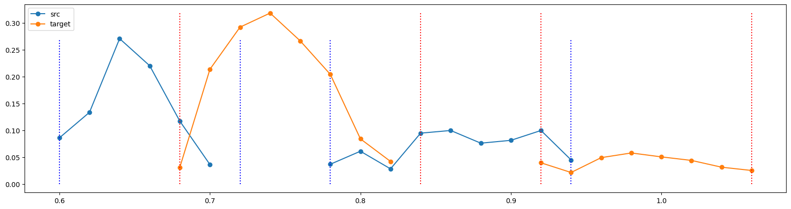

# Tutorial: morphing

While CLEESE is primarily designed to randomize stimuli by transforming a base stimulus with randomly generated 'filters', its underlying transformation engines can be used to create 'morphings' between 2 predefined stimuli. This tutorial shows how to use CLEESE's `PhaseVocoder` engine to create sounds that have parametrically intermediate pitch, intensity and duration contours between a source and a target sound. 

In more details, the procedure involves, first, estimating the pitch, rms or duration contour of both source and target sounds (using e.g. `times,pitch = PhaseVocoder.extract_pitch(wave,sr)` ), creating intermediate contours by e.g. interpolating linearly between the source and target values at every time point, and applying this contour as a bpf to the source sound. This is not unlike the procedure to flatten files (where we first measure the original pitch contour, create a bpf that compensates that contour, and apply it again) described [here](https://neuro-team-femto.github.io/cleese/tutorials/speech/#flattening-files)). 


<!-- 
###### 6 random variants of French phase _"je suis en route pour la réunion"_ (I'm on my way to the meeting)
<audio controls src="../sounds/variation_pitch.wav"></audio><br>
<a href="../sounds/variation_pitch.wav"> Download audio </a> 
-->

## Preambule

### Verify your installation

Before starting, please verify that you have a working CLEESE installation, by running the following cell which should return without error. 

``` py title="import cleese"
import cleese_stim as cleese
from cleese_stim.engines import PhaseVocoder
```
Check the [installation instructions](../../installation) if needed. 

### Useful imports

The following code imports all the python packages that are needed in the rest of this tutorial (which you can `pip install` if you don't have them already). 

```py title="extra imports"
import numpy as np
from scipy import signal 
from matplotlib import pyplot as plt
```

### Useful files

In the following, we'll be a number of files which you'll first need to download and store in your path at the indicated place

- [apri_Q](./sounds/apri_Q.wav) :material-arrow-right: `./sounds/apri_Q` : the recording of a word pronounced as a question
- [apri_I](./configs/apri_I.wav) :material-arrow-right: `./sounds/apri_I` : another recording of the same word, this time pronounced as a statement

!!! note
    Both sounds were kindly provided by Dr. [James Trujillo](https://jptrujillo.github.io/) (University of Amsterdam), who also provided the use case of this tutorial

- [random_pitch_profile.toml](./configs/random_pitch_profile.toml) :material-arrow-right: `./configs/random_pitch_profile.toml` : a configuration file used to manipulate pitch
- [random_speed_profile.toml](./configs/random_speed_profile.toml) :material-arrow-right: `./configs/random_speed_profile.toml` : a configuration file used to manipulate speed/duration
- [random_rms_profile.toml](./configs/random_rms_profile.toml) :material-arrow-right: `./configs/random_rms_profile.toml` : a configuration file used to manipulate intensity/rms

## Morphing duration contours 

As a first step, we'll use the `PhaseVocoder` engine's ability to stretch sounds along arbitrary temporal contours in order to morph the duration of the two words. 

### Compute the duration transformation needed to convert source to target

First, let's load the two sounds using the `PhaseVocoder.wav_read` utility function. Arbitrarily, let's choose our source file (the one to be transformed) to be the question intonation, and our target file the statement/answer intonation. 

```
src_wav, sr, frmt =  PhaseVocoder.wav_read('./sounds/apri_Q.wav')
target_wav, sr, frmt =  PhaseVocoder.wav_read('./sounds/apri_I.wav')
```

We then estimate the intensity profile of each sound, in order to visualize how they differ. The `PhaseVocoder.extract_rms` utility simply extracts root-mean-square intensity on every successive time window (duration `win` sec., here 20ms), and offers the possibility to threshold the resulting time series to only export values larger than a given intensity (put here to 0.02, but you may want to adapt this value manually to e.g. background noise). 

```
src_times, src_rms = PhaseVocoder.extract_rms(src_wav, sr, win=.02, thresh=0.02, interpolate=False)
target_times, target_rms = PhaseVocoder.extract_rms(target_wav, sr, win=.02,thresh=0.02, interpolate=False)

plt.figure(figsize=(20,5))
plt.plot(src_times, src_rms, 'o-', label='src')
plt.plot(target_times, target_rms, 'o-',label='target')
plt.legend()

```


Our source/question word (blue) <br>
<audio controls src="../sounds/apri_Q.wav"></audio><br> has two distinct syllables (A/PRI), the first being a bit shorter, and the second a bit trailing. In comparison, the target/statement version of the same word (orange) <br>
<audio controls src="../sounds/apri_I.wav"></audio> <br>
has a longer first syllable, and a shorter second. Similarly, the gap between the two question-syllables is a little shorter than between the two statement-syllables. Transforming the source into the target would therefore entail progressively stretching the first question-syllable, stretching the pause, and shortening the second segment, until the blue curve matches the morphology of the orange curve.

!!! note
    Note the two words also differ by a lot more than syllable duration: from the graph above, we see that their intensity profiles differ notably on the first syllable (a louder syllable with a sharper onset for the target). Auditorily, it's also obvious that their pitch differs greatly, with an expected final pitch rise in the question/source file. In this section, we only transform duration, but below we will show how to also (or independently) transform intensity and pitch.  

!!! note
    Note also the two sounds don't start exactly at the same time in the file (the source sound as its onset around 600ms into the file; the target sound around 680ms), as often happens with naturalistic recordings. While this is not necessarily an issue, we'll also be using stretch to normalize that difference, while we're at it (see below)

### Format this as a CLEESE bpf

To do all that we will create a BPF (breakpoint function) that lists what stretch factor to be applied at which time point in the file. First, we identify the temporal boundaries of the segments that we want to modify in each file: each syllable, as well as the gap between them. 

```
# extract temporal bounds for the different segments
def extract_bounds(times, values): 
    '''
    returns the start and end of every section composed of either consecutive nan or consecutive non-nans
    '''
    indices= [True]+ list(np.diff(np.isnan(values)))
    indices[-1] = True
    return list(times[indices])
    
src_bounds = extract_bounds(src_times, src_rms)
target_bounds = extract_bounds(target_times,target_rms)

plt.figure(figsize=(20,5))
plt.plot(src_times, src_rms, 'o-', label='src')
for bound in src_bounds:
    plt.plot([bound,bound],[0,np.nanmax(src_rms)],'b:')
plt.plot(target_times, target_rms, 'o-',label='target')
for bound in target_bounds: 
    plt.plot([bound,bound],[0,np.nanmax(target_rms)],':r')
plt.legend()

```



Next, we define a bpf where the time points correspond to the boundaries of the segments, and the stretch at each of these segments corresponds to the ratio of duration between the corresponding segments in the source and target sound. 

```
# add t=0 in the bounds, so we also compute the stretch necessary to align the onset of the two sounds
if src_bounds[0] > 0: 
    src_bounds = np.insert(src_bounds,0,0)
if target_bounds[0] > 0: 
    target_bounds = np.insert(target_bounds,0,0)

# the stretch transformation is acting at each time where RMS was detected in question_wav
stretch_bpf_times = src_bounds

# the target stretch at each of these ratio of duration between the corresponding segments in questions and statement bounds
stretch_bpf_val = [target/src for src, target in zip(np.diff(src_bounds),
                                                              np.diff(target_bounds))]

# display tentative bpf
stretch_bpf_val_temp = np.insert(stretch_bpf_val,0,stretch_bpf_val[0])
plt.step(stretch_bpf_times, stretch_bpf_val_temp, 'k-o', where='pre')
plt.xlabel('time in file')
plt.ylabel('BPF')

```


The resulting bpf, as should be, spreads around the 1:1 ratio (i.e. no change). It starts at 1.13, which corresponds to the stretching (>1) of the initial silence segment (in effect delaying the onset of the question to match the statement onset); then stretches both the first question syllable and the pause between syllables by what happens to be the same ratio (x1.33); and finally shortens the last question syllable by x.875 (i.e. 87% of its original duration). 

!!! warning
    The code above is brittle, as it assumes that there are the same number of segments in both source and target sounds. It is the case in this example (both start > 0, both have 3 segments: one syllable, one pause and one syllable), but this may well not be the case if you use other pairs of sounds. Adjust manually until you have the same number of segments, for instance by changing the `extract_rms` threshold (which, if set low enought will only output one segment per sound). It is also possible to manually set segment boundaries, e.g. by identifying them in audacity, and not use semi-automatic rms segmentation as we show here (see example [here](https://neuro-team-femto.github.io/cleese/tutorials/speech#using-custom-breakpoints)). 

To apply this bpf, we simply call `cleese.process_data` on the source sound, passing it as the `bpf=BPF` argument, and using a configuration file that tells it it should apply the stretch transformation. 

However, before we can do that, we need a little hack. Up until at least [v2.3.2](https://github.com/neuro-team-femto/cleese/releases/tag/v.2.3.2), CLEESE assumes a slightly different format for bpfs when they are passed directly with the `bpf=BPF` keyword, compared to when they are generated autonomously by the system. When generated by the system, bpfs can be made as `square` or `ramp`, depending on the `BPFtype` parameter in the config file. When custom bpfs are passed directly however, that parameter is ignored ([issue 33](https://github.com/neuro-team-femto/cleese/issues/33)), and whatever bpf values are passed are automatically interpolated linearly between time points, as if it was a ramp. So, even though `stretch_config_file` attempts to set `BPFtype='square'`, that parameter is ignore, and we have to prepare our custom bpf before passing it to `cleese.process_data` so that its linear interpolation generates the `square` bpf that we eventually want the function to use. 

```
# format bpf so it can be interpolated

transition_time = 0.01 #10ms

# need duration of source file in seconds
duration = (src_wav.shape[0])/sr

# insert t=0 at the beginning
stretch_bpf_times = np.insert(stretch_bpf_times, 0,0)

# every time point is replaced by one slightly earlier, and one slightly later, separated by transition_time
stretch_bpf_times = np.sort(np.concatenate((
            np.array(stretch_bpf_times[1:-1])-transition_time/2,
            np.array(stretch_bpf_times[1:-1])+transition_time/2)))

# check boundary conditions
if stretch_bpf_times[-1] > duration:
    stretch_bpf_times = np.delete(stretch_bpf_times, -1)
if stretch_bpf_times[0] < 0:
    stretch_bpf_times = np.delete(stretch_bpf_times, 0)

# add t=0 and t=duration
stretch_bpf_times = np.append(stretch_bpf_times, duration)
stretch_bpf_times = np.insert(stretch_bpf_times, 0, 0.)

# duplicate all bpf values too 
stretch_bpf_val = np.repeat(stretch_bpf_val,2)

# display new bpf
plt.plot(stretch_bpf_times, stretch_bpf_val, 'k-o')
plt.xlabel('time in file')
plt.ylabel('BPF')

```


The resulting bpf has the same values as before, but is formatted in such a way that its linear interpolation looks like a `square` bpf (notice we use `plt.plot` and not `plt.step` here, compared to previous visualization). 

### Apply the bpf to the source file

Now we can finally apply the bpf to the file

```
# config file
stretch_config_file = "./configs/random_speed_profile.toml"

bpf = np.column_stack((stretch_bpf_times,stretch_bpf_val))

# transform sound
transf_wav,transf_bpf = cleese.process_data(PhaseVocoder, src_wav, stretch_config_file, sample_rate=sr, BPF=bpf)

# and save in sound file
PhaseVocoder.wav_write(transf_wav, './sounds/src_stretch.wav', sr, sample_format=frmt)

```
Visualize the result: 

```
transf_times, transf_rms = PhaseVocoder.extract_rms(transf_wav, sr, win=.02, thresh=0.02, interpolate=False)

plt.figure(figsize=(20,5))
plt.plot(src_times, src_rms, 'o-', label='src')
plt.plot(target_times, target_rms, 'o-', label='target')
plt.plot(transf_times, transf_rms, 'o:',label='transf')
plt.legend()
```


The transformed sound (dotted, green) has the expected temporal morphology: it has been shifted in time and is now aligned with the target sound (orange); its first syllable and the pause between syllables have been stretched, and its second syllable has been shortened, all to match the duration of the target sound's. As already noted above, the stretch transformation has only shifted parts of sounds in time, but hasn't modified their intensity: the transformed first syllable is less intense that the target's, while the transformed second syllable is more intense than the target. Such adjustements of intensity will be done below. 

The resulting sound <br>
<audio controls src="../sounds/src_stretch.wav"></audio><br> has the same rising-pitch intonation as the source sound, but a subtly different prosody from the original question <br>
<audio controls src="../sounds/apri_Q.wav"></audio> <br>
with a longer first syllable and a longer pause (/ap'pri/), making it sound perhaps a little more hesitating than the original. 
One can compare its duration contour with the target sound, which has a markedly different pitch intonation: 
<br>
<audio controls src="../sounds/apri_I.wav"></audio> <br>

### Create successive morphings

If one want to make intermediate examples, one only has to modulate the stretch factor by multiplying it by a factor between 0 (0% transformation, identical to source) and 1 (100% transformation, similar to target). More precisely, because stretch factors are centered on 1:1, one should multiply its difference to 1, as `1 + factor*(stretch_bpf_val - 1)`


```
plt.figure(figsize=(20,5))
plt.plot(src_times, src_rms, 'o-', label='src')
plt.plot(target_times, target_rms, 'o-', label='target')

for factor in np.arange(0,1.1,0.1): # % of morphing, between 0% and 100%
    
    # modulate the stretch factor by multiplying its difference to 1 by a factor between 0 and 1
    factor_val = 1 + factor*(stretch_bpf_val - 1) 
    bpf = np.column_stack((stretch_bpf_times,factor_val))

    # apply transformation
    transf_wav,transf_bpf = cleese.process_data(PhaseVocoder, src_wav, stretch_config_file, sample_rate=sr, BPF=bpf)
    
    # save file
    PhaseVocoder.wav_write(transf_wav, 'src_stretch_%.1f.wav'%factor, sr, sample_format=frmt)
    
    # visualize the rms contour of that transformation
    transf_times, transf_rms = PhaseVocoder.extract_rms(transf_wav, sr, win=.02, thresh=0.02, interpolate=False)
    plt.plot(transf_times, transf_rms, '-',label='transf', alpha=0.3)
    
plt.legend()
```


We see successive intermediate morphings between source and target behave as expected. Compare e.g. transformation at 0%<br>
<audio controls src="../sounds/src_stretch_0.0.wav"></audio> <br> 
transformation at 50% <br>
<audio controls src="../sounds/src_stretch_0.5.wav"></audio> <br> 
and transformation at 100%<br>
<audio controls src="../sounds/src_stretch_1.0.wav"></audio> <br> 