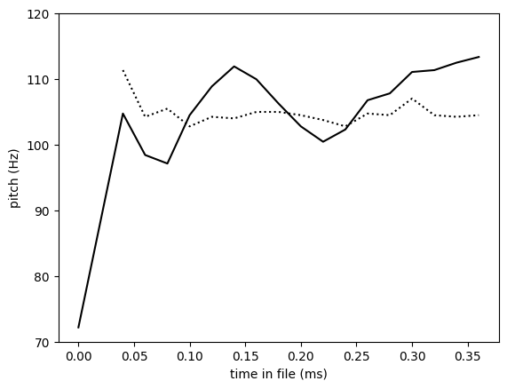
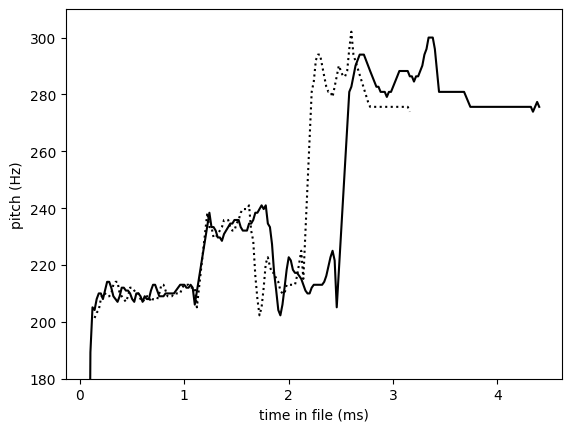
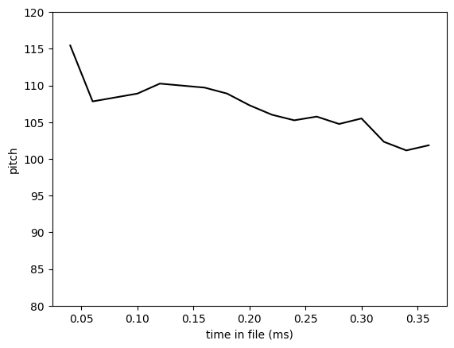
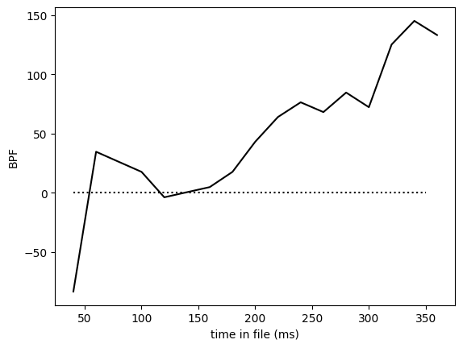
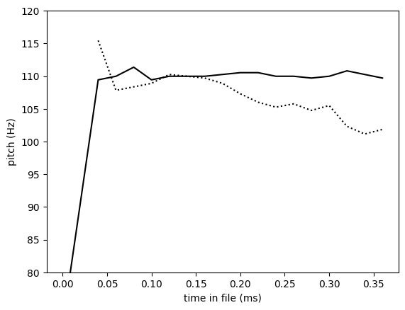
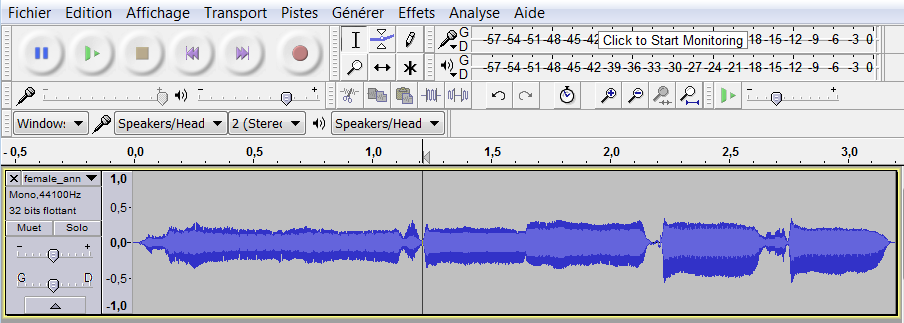
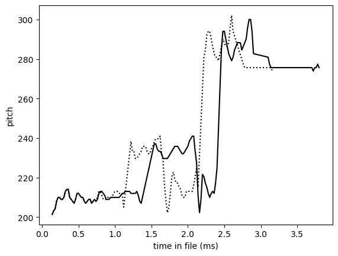

# Tutorial: random speech generation

This tutorial shows how to use CLEESE's `PhaseVocoder` engine to generate a arbitrary number of expressive variations around an original speech recording.

###### 6 random variants of French phase _"je suis en route pour la réunion"_ (I'm on my way to the meeting)
<audio controls src="../sounds/variation_pitch.wav"></audio><br>
<a href="../sounds/variation_pitch.wav"> Download audio </a>

## Preambule

### Verify your installation

Before starting, please verify that you have a working CLEESE installation, by running the following cell which you return without error. 

``` py title="import cleese"
import cleese_stim as cleese
from cleese_stim.engines import PhaseVocoder
```
Check the [installation instructions](../../installation) if needed. 

### Useful imports

The following code imports all the python packages that are needed in the rest of this tutorial (which you can `pip install` if you don't have them already). 

```py title="extra imports"
import numpy as np
import matplotlib.pyplot as plt
```

### Useful files

In the following, we'll be a number of files which you'll first need to download and store in your path at the indicated place

- [male_vraiment_flattened.wav](./sounds/male_vraiment_flattened.wav) :material-arrow-right: `./sounds/male_vraiment_flattened.wav` 
- [random_pitch_profile.toml](./configs/random_pitch_profile.toml) :material-arrow-right: `./configs/random_pitch_profile.toml`
- [female_anniversaire_isochrone.wav](./sounds/female_anniversaire_isochrone.wav) :material-arrow-right: `./sounds/female_anniversaire_isochrone.wav`
- [random_speed_profile.toml](./configs/random_speed_profile.toml) :material-arrow-right: `./configs/random_speed_profile.toml`
- [chained_pitch_stretch.toml](./configs/chained_pitch_stretch.toml) :material-arrow-right `./configs/chained_pitch_stretch.toml`
- [male_vraiment_original.wav](./sounds/male_vraiment_original.wav) :material-arrow-right: `./sounds/male_vraiment_original.wav` 

## Basic sound manipulation with CLEESE

### Random pitch profile in a single utterance

The most basic usage scenario of CLEESE is to input a single recording (ex. the French word "vraiment" - "really", recorded by a single male speaker)

<audio controls src="../sounds/male_vraiment_flattened.wav"></audio><br>
<a href="../sounds/male_vraiment_flattened.wav"> Download audio </a>

and use CLEESE to transform the sound with a random pitch profile. This, like all cleese operations, is done by passing to the main cleese function `cleese.process_data` a configuration file ([random_pitch_profile.toml](./configs/random_pitch_profile.toml)) which specifies the manipulation we want. Here: cut the file in `pitch.window.count = 6` time segments, draw a random pitch shift factor at each segment boundary from a Gaussian distribution centered on 0 and standard deviation `pitch.std = 300`cents, and interpolate between segment boundaries using linear `pitch.BPFType = "ramp"`. (See [PhaseVocoder](../../api/phase-vocoder/) documentation for more information)

```toml title="random_pitch_profile.toml"
[pitch]
# pitch transposition window in seconds. If 0 : static transformation
window.len = 0.11

# number of pitch transposition windows. If 0 : static transformation
window.count = 6

# 's': force winlength in seconds,'n': force number of windows (equal length)
window.unit = 'n'

# standard deviation (cents) for random transposisiton (Gaussian distrib for now)
std = 300

# truncate distribution values (factor of std)
trunc = 1

# type of breakpoint function:
#      'ramp': linear interpolation between breakpoints
#      'square': square BPF, with specified transition times at edges
BPFtype = 'ramp'

# in s: transition time for square BPF
trTime = 0.02
```

The following code is pretty much all there is to call: `cleese.process_data` takes in the `Engine` that is called on to do the transformation (here, `PhaseVocoder` - see the [Image tutorial](../face) for a similar call to image-transformation engine `FaceWarp`), the array `wave_in` of audio data obtained from `PhaseVocoder.wav_read` and its sampling rate `sr`, and the path to the configuration file `config_file` that tells the `PhaseVocoder` engine what to do with it all. 

```python title="randomize pitch"
input_file = "./sounds/male_vraiment_flattened.wav"
config_file = "./configs/random_pitch_profile.toml"

# read input wavefile
wave_in, sr, _ = PhaseVocoder.wav_read(input_file)

# transform sound
wave_out,bpf_out = cleese.process_data(PhaseVocoder, wave_in, config_file, sample_rate=sr)

# save file if necessary
output_file = "./sounds/male_vraiment_flattened_transformed.wav"
PhaseVocoder.wav_write(wave_out, output_file, sr)
```

<audio controls src="../sounds/male_vraiment_flattened_transformed.wav"></audio><br>
<a href="../sounds/male_vraiment_flattened_transformed.wav"> Download audio </a>

The `bpf_out` output describes the break-point function that was generated randomly by CLEESE and used to transform `wave_in` to `wave_out`. It is a simple array of times and values pairs, each corresponding to the timepoint in the file of a breakpoint and the corresponding pitch transformation values applied at this point (for more on BPFs, see the [PhaseVocoder documentation](../../api/phase-vocoder/#bpfs)).  

```py 
print(bpf_out)
```
```txt
[[ 0.00000000e+00 -1.01767821e+02]
 [ 7.10430839e-02 -9.91175403e+01]
 [ 1.42086168e-01  1.07735422e+02]
 [ 2.13129252e-01 -3.87725633e+01]
 [ 2.84172336e-01  5.15893896e+01]
 [ 3.55215420e-01  1.46774252e+02]
 [ 4.26258503e-01 -5.06624397e+00]]
```
Here, one sees that the file duration is about 426ms and that, consistently with the `window.count = 6` parameter in the config file, the transformation uses 7 breakpoints, i.e. 6 segments. Each breakpoint is associated a pitch transformation value in cents which, here, was assigned random samples ranging between -101.7 and +146.7, which is consistent with the `std = 300` parameter in the config_file. The general shape of the transformation, in that specific random instance, is to reduce the beginning of the sound by ca. 100 cents (i.e. - 1 semitone), then increase it by +100 cents (compared to baseline) around 142ms, down again at 213ms, back up to +146cents at 355ms, i.e. a shape that is roughly that of letter W. Of course, every call to the same code will generate a new, random bpf and transformation. 

!!! Note "About cents"
    Cents are a relative unit of frequency which corresponds to 1% of a musical semitone. Increasing a frequency $f_1$ by $+n$ cents results in $f_2 = f_1 * 2^{n/1200}$. Increasing sound's pitch by +100cents is equivalent to raising it by 1 semitone ($f_1*2^{1/12})$, i.e. the same as going from musical notes C to C#. A change of 12 semitone (1200 cents) corresponds to going up one octave (e.g. C3 :material-arrow-right: C4), corresponding to doubling frequency ($f_1 * 2^{1200/1200}$). In speech, pitch changes of the order of 100-200 cents are considered large; a static change of +50cents is often sufficient to evoke e.g. the impression of happier speech ([Rachman et al. 2018](https://link.springer.com/article/10.3758/s13428-017-0873-y)). Technically, CLEESE's `PhaseVocoder` engine implements a relatively straightforward version of the phase vocoder algorithm (phase locking with frame-wise peak picking and no spectral envelope conservation, see e.g. [Laroche and Dolson, 1999](https://ieeexplore.ieee.org/abstract/document/759041)), and will likely generate artifacts such as phasiness for transformations larger than 150-200 cents (which may or may not be a problem depending on your usage scenario) 


CLEESE's `PhaseVocoder` includes a utility for extracting pitch in speech/audio files (`PhaseVocoder.extract_pitch`), which uses the YIN pitch extraction algorithm, and can be used to visualize the pitch profile of sounds before and after manipulation. This is just for visualization purposes, and isn't necessary for the working of the main `cleese.process` function above. 

``` py title="visualize pitch before/after"
# extract pitch before transformation
times_in,pitch_in = PhaseVocoder.extract_pitch(wave_in,sr)

# extract pitch after transformation
times_out,pitch_out = PhaseVocoder.extract_pitch(wave_out,sr)

# display 
plt.plot(times_in, pitch_in, 'k:', label='pre')
plt.plot(times_out, pitch_out, 'k', label='post')
plt.xlabel('time in file (ms)')
plt.ylabel('pitch (Hz)')
plt.ylim([70,120])
```




### Random speed profile in a song 

CLEESE can process longer files than a single word and, instead of manipulating pitch, can manipulate the duration of each portion of the file. To demonstrate this, we use CLEESE to randomly stretch each note in a recording of a song (the French song "Joyeux Anniversaire" / "Happy Birthday", sung by a female singer)

<audio controls src="../sounds/female_anniversaire_isochrone.wav"></audio><br>
<a href="../sounds/female_anniversaire_isochrone.wav"> Download audio </a>

This, as above, is done by passing to `cleese.process_data` a configuration file which specifies the manipulation we want. Here: cut the file in `stretch.window.len = 0.5` second time segments, draw a random stretch shift factor at each segment boundary from a Gaussian distribution centered on 1.0 and standard deviation `stretch.std = 1.5` (where factors >1 correspond to a time stretch, and factors <1 correspond to a time compression), and interpolate between segment boundaries using linear `stretch.BPFType = "ramp"`. 

```toml title="random_speed_profile.toml"
[stretch]

window.len = 0.1
window.count = 5
window.unit = 'n'

# stretching factor. >1: expansion, <1: compression
std = 1.5
trunc = 1
BPFtype = 'ramp'
trTime = 0.05
```

The following code runs the transformation

```python title="randomize duration"
input_file = "./sounds/female_anniversaire_isochrone.wav"
config_file = "./configs/random_speed_profile.toml"

# read input wavefile
wave_in, sr, _ = PhaseVocoder.wav_read(input_file)

# CLEESE
wave_out,bpf_out = cleese.process_data(PhaseVocoder, wave_in, config_file, sample_rate=sr)

# save file if necessary
output_file = "./sounds/female_anniversaire_isochrone_transformed.wav"
PhaseVocoder.wav_write(wave_out, output_file, sr)
```

<audio controls src="../sounds/female_anniversaire_isochrone_transformed.wav"></audio><br>
<a href="../sounds/female_anniversaire_isochrone_transformed.wav"> Download audio </a>

```py 
print(bpf_out)
```
```txt
[[0.         0.72650135]
 [0.64062585 1.        ]
 [1.2812517  1.42662854]
 [1.92187755 1.16536151]
 [2.5625034  2.382554  ]
 [3.20312925 1.28544142]]
```

Again, inspection of the (randomly generated) BPF shows 5 segments/6 breakpoints, regularly spaced from t=0 to t=3.2 sec. The stretch values are generated with a gaussian distribution centered on 1 (1:1 ratio, corresponding to no change of duration) and, in that specific instance, are mostly > 1, which explains that the sound above is longer than the original. The largest stretch (x2.38 in duration) occurs at the end of the sound, ca. 2.56sec, which can be heard in the longer final last 2 syllables (_/veeeer/saaaaaire/_) in the extract above.  

As above, one can use the `extract_pitch` utility to visualize the difference between the two files. Notice that, contrary to the `pitch` transform above, the actual pitch values in the two sounds are not changed, but only how they unfold in time. 


```py title="visualize before and after transform"
# extract pitch before transformation
times_in,pitch_in = PhaseVocoder.extract_pitch(wave_in,sr)
# extract pitch after transformation
times_out,pitch_out = PhaseVocoder.extract_pitch(wave_out,sr)

# display 
plt.plot(times_in, pitch_in, 'k:')
plt.plot(times_out, pitch_out, 'k', label='post')
plt.xlabel('time in file (ms)')
plt.ylabel('pitch (Hz)')

plt.ylim([180,310])

```




### Batched transforms 

Instead of generating output files one at a time, CLEESE can be used to generate large numbers of manipulated files, each randomly generated using parameters specified in config files as above. This is achieve by pusing cleese.generate_stimuli `cleese.generate_stimuli(PhaseVocoder, input_file, config_file)`. Output files are not returned by the function, but directly written in `main.outPath`, and the number of output files generated is given by `main.numFiles`, all of which are found in the configuration file:

```toml title="random_pitch_profile.toml"
[main]

# output root folder
outPath = "./output/"

# number of output files to generate (for random modifications)
numFiles = 10

# apply transformation in series (True) or parallel (False)
chain = true

# transformations to apply
transf = ["pitch"]

# generate experiment folder with name based on current time
generateExpFolder = true
```

The following code will create 10 random transformations of the `input_file`, each with random parameters generated from `config_file`, and store both files and parameters in the `outPath` folder designated in `config_file` 

!!! note
    If the `outPath` directory doesn't exist in your working directory, it will be created automatically. 

```python title="batch transform"
input_file = "./sounds/male_vraiment_flattened.wav"
config_file = "./configs/random_pitch_profile.toml"

# CLEESE
cleese.generate_stimuli(PhaseVocoder, input_file, config_file)

```

<audio controls src="../sounds/male_vraiment_flattened_transformed_1.wav"></audio> 
<a href="../sounds/male_vraiment_flattened_transformed_1.wav"> Download audio </a> <br>
<audio controls src="../sounds/male_vraiment_flattened_transformed_2.wav"></audio>
<a href="../sounds/male_vraiment_flattened_transformed_2.wav"> Download audio </a> <br>
<audio controls src="../sounds/male_vraiment_flattened_transformed_3.wav"></audio>
<a href="../sounds/male_vraiment_flattened_transformed_3.wav"> Download audio </a> <br>
<audio controls src="../sounds/male_vraiment_flattened_transformed_4.wav"></audio>
<a href="../sounds/male_vraiment_flattened_transformed_4.wav"> Download audio </a> <br>
...

### Chained transforms 

CLEESE can process files with a series of transformations that follow each other, e.g. first time-stretch the file, then pitch-shift it. This is done by specifying keyword `chain = true` under the configuration section `[main]`, as well as the list of transformations to be applied, e.g. here `transf = ['pitch','stretch']`.  

```toml title="chained_pitch_stretch.toml"
[main]

# output root folder
outPath = "./output/"

# number of output files to generate (for random modifications)
numFiles = 10

# apply transformation in series (True) or parallel (False)
chain = true

# transformations to apply
transf = ["pitch", "stretch"]

# generate experiment folder with name based on current time
generateExpFolder = true
```

The following code runs a chained transformation (notice the change of `config_file`) on 10 files, and stores them all in the `outPath` folder designated in `config_file`

```py title="chained transform"
input_file = "./sounds/male_vraiment_flattened.wav"
config_file = "./configs/chained_pitch_stretch.toml"

# CLEESE
cleese.generate_stimuli(PhaseVocoder, input_file, config_file)
```


<audio controls src="../sounds/male_vraiment_flattened_transformed_5.wav"></audio> 
<a href="../sounds/male_vraiment_flattened_transformed_5.wav"> Download audio </a> <br>
<audio controls src="../sounds/male_vraiment_flattened_transformed_6.wav"></audio>
<a href="../sounds/male_vraiment_flattened_transformed_6.wav"> Download audio </a> <br>
<audio controls src="../sounds/male_vraiment_flattened_transformed_7.wav"></audio>
<a href="../sounds/male_vraiment_flattened_transformed_7.wav"> Download audio </a> <br>
<audio controls src="../sounds/male_vraiment_flattened_transformed_8.wav"></audio>
<a href="../sounds/male_vraiment_flattened_transformed_8.wav"> Download audio </a> <br>

## Advanced use

### Flattening files

When applying CLEESE to generate stimuli for reverse correlation, it is often advisable to use base stimuli that are as flat as possible (e.g., if randomizing pitch, start with a sound that has constant pitch). CLEESE can be used to flatten an existing recording, using the trick of not letting the tool generate its own random breakpoint function, but rather providing it with a custom function that inverts the natural pitch variations found in the original file. We demonstrate this with an original, non flattened recording of the word "vraiment". 

Start with a normal, non-flat recording of the same word ``vraiment'' as above: 

<audio controls src="../sounds/male_vraiment_original.wav"></audio><br>
<a href="../sounds/male_vraiment_original.wav"> Download audio </a>

The file has a soft, down-ward pitch contour, as show here

``` py title="display original pitch"
input_file = "./sounds/male_vraiment_original.wav"
wave_in, sr, _ = PhaseVocoder.wav_read(input_file)
times_in,pitch_in = PhaseVocoder.extract_pitch(wave_in,sr, win=0.02, bounds=[50, 200])
plt.plot(times_in, pitch_in, 'k')
plt.xlabel('time in file (ms)')
plt.ylabel('pitch')
plt.ylim([80,120])
```



To flatten this existing contour, we construct a custom break-point function (bpf) that passes through the pitch shift values needed to shift the contour down to a constant pitch value, arbitrarily set here at 110Hz. 


```py title="custom bpf"
mean_pitch = 110.
def difference_to_cents(pitch, ref_pitch):
    if pitch >0:
        return -1200*np.log2(pitch/ref_pitch)
    else:
        return 1
bpf_times = times_in
bpf_val = np.array([difference_to_cents(hz, mean_pitch) for hz in pitch_in])
# display original file
plt.plot(1000*bpf_times, bpf_val, 'k')
plt.xlabel('time in file (ms)')
plt.ylabel('BPF')
plt.plot([40,350],[0,0],'k:')
```


    

We then apply this custom BPF to the original file, using `cleese.process_data(PhaseVocoder, wave_in, config_file, sample_rate=sr, BPF=bpf)` (passing audio data as input, because we don't need batch mode here). 

```python title="apply bpf"
config_file = "./configs/random_pitch_profile.toml"

# CLEESE
bpf = np.column_stack((bpf_times,bpf_val))
wave_out,bpf_out = cleese.process_data(PhaseVocoder, wave_in, config_file, sample_rate=sr, BPF=bpf)
```

<audio controls src="../sounds/male_vraiment_flattened.wav"></audio><br>
<a href="../sounds/male_vraiment_flattened.wav"> Download audio </a>

Compare pitch profile before and after transformation: 

```py title="display resulting pitch"
# display transformed file
times_out,pitch_out = PhaseVocoder.extract_pitch(wave_out,sr, win=0.02, bounds=[100, 200])
plt.plot(times_in, pitch_in, 'k:')
plt.plot(times_out, pitch_out, 'k')
plt.xlabel('time in file (ms)')
plt.ylabel('pitch (Hz)')
plt.ylim([80,120])
```




### Using custom breakpoints

Instead of generating linearly spaced time windows (or, as called here, breakpoints), CLEESE supports a list of externally provided time positions. To demonstrate this, we use CLEESE to stretch the duration of each note in the song "Joyeux Anniversaire" (which we already used above). 

<audio controls src="../sounds/female_anniversaire_isochrone.wav"></audio><br>
<a href="../sounds/female_anniversaire_isochrone.wav"> Download audio </a>

To find note boundaries, we can e.g. use an external audio editor such as [Audacity](https://www.audacityteam.org), and measure time positions between notes as `[0.027, 0.634, 1.137, 1.647, 2.185, 2.649, 3.181]`.



We can then generate a breakpoint function with `cleese.create_BPF` which uses these time points and parameters loaded from the stretch config file `config_file`. This BPF can then be passed to `cleese.process_data` as argument. 


```python title="process with custom breakpoints"
input_file = "./sounds/female_anniversaire_isochrone.wav"
config_file = "./configs/random_speed_profile.toml"

wave_in, sr, _ = PhaseVocoder.wav_read(input_file)

time_points = np.array([0.027, 0.634, 1.137, 1.647, 2.185, 2.649, 3.181]) # values found in audacity
num_points = len(time_points)
bpf = PhaseVocoder.create_BPF(
    'stretch',config_file,time_points,num_points,0)   

wave_out,bpf_out = cleese.process_data(
    PhaseVocoder, wave_in, config_file, sample_rate=sr, BPF=bpf)
```

The resulting file has random duration, but these changes of pace are aligned with note boundaries. 

<audio controls src="../sounds/female_anniversaire_isochrone_transformed_2.wav"></audio><br>
<a href="../sounds/female_anniversaire_isochrone_transformed_2.wav"> Download audio </a>

```py title="display pitch before/after"
times_in,pitch_in = PhaseVocoder.extract_pitch(wave_in,sr)
plt.plot(times_in, pitch_in, 'k')
plt.xlabel('time in file (ms)')
plt.ylabel('pitch')

# display transformed file
times_out,pitch_out = PhaseVocoder.extract_pitch(wave_out,sr)
plt.plot(times_out, pitch_out, 'b')
plt.xlabel('time in file (ms)')
plt.ylabel('pitch')
```



